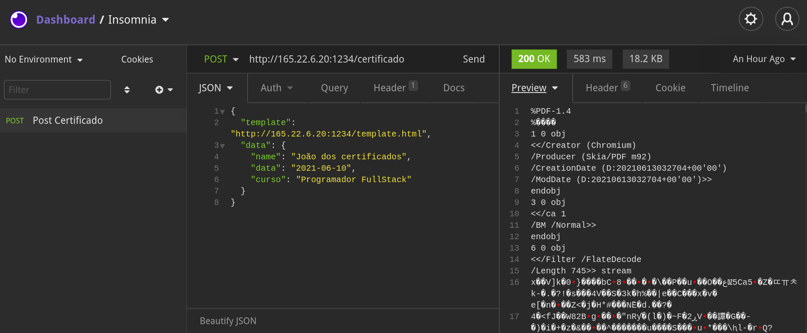
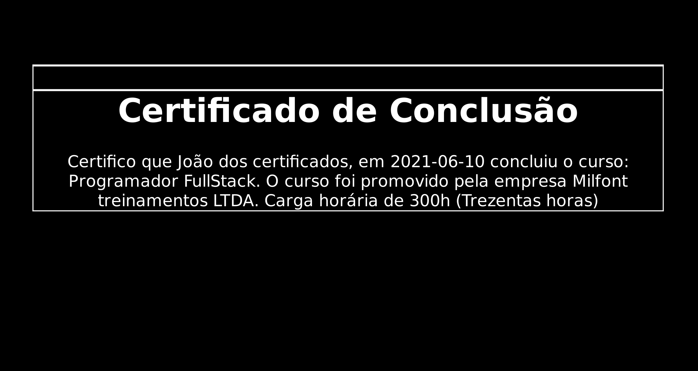
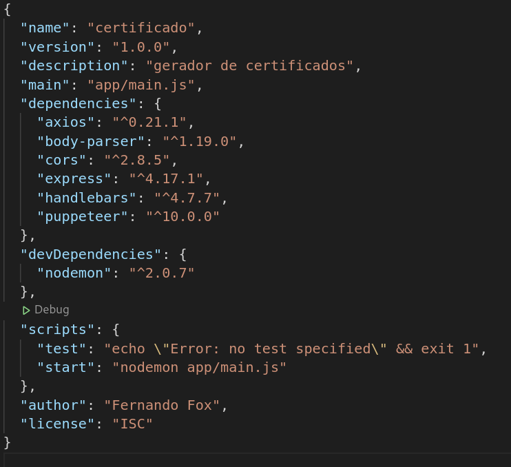
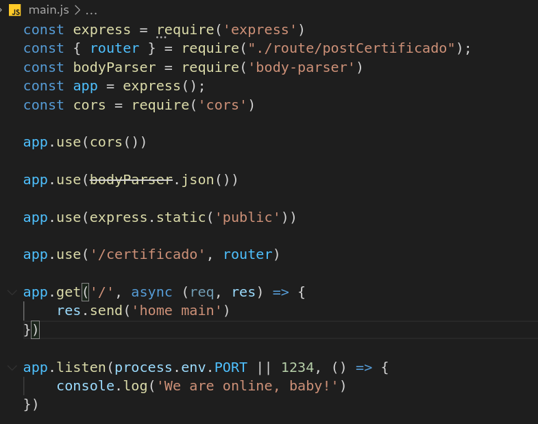
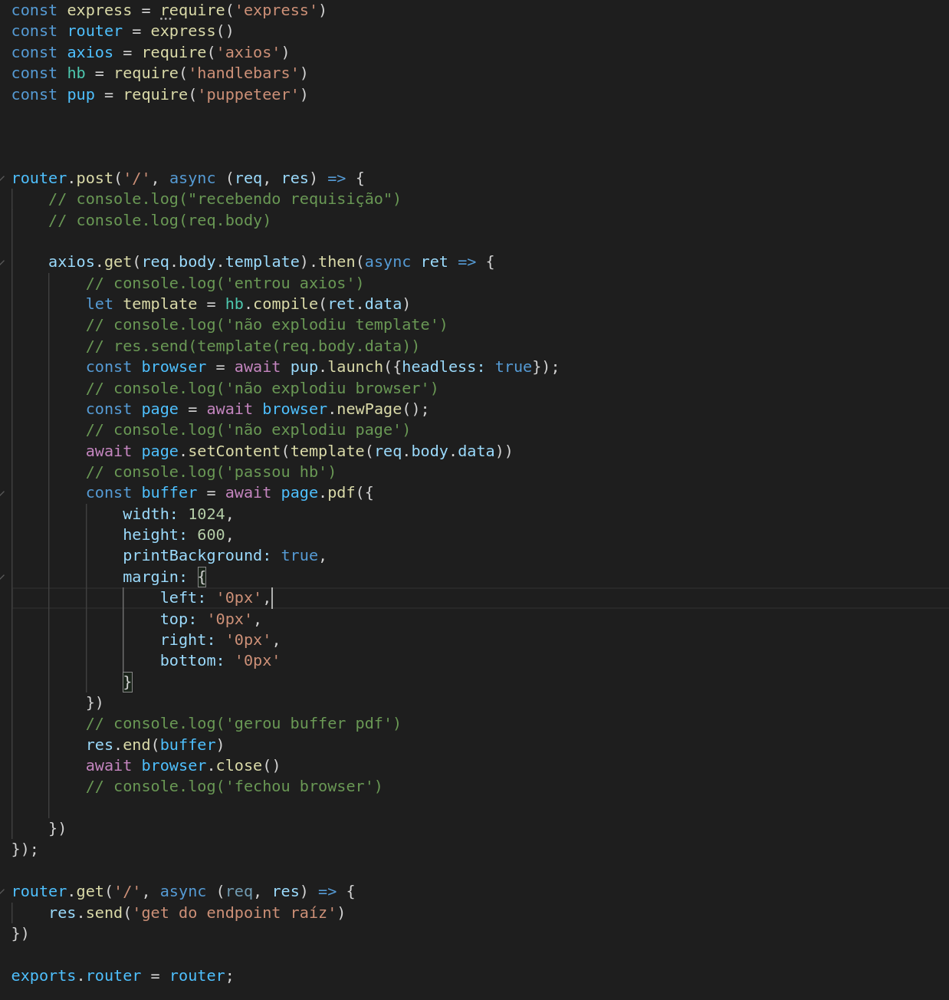
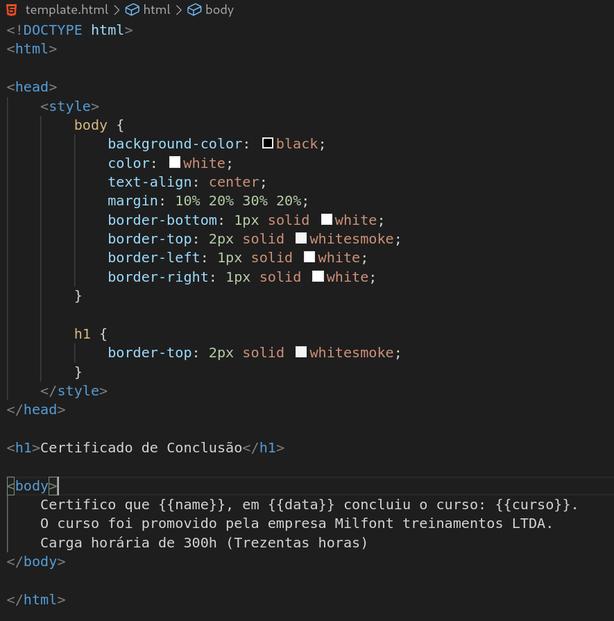

# Projeto de nivelamento, turmas do Milfont.

  **Objetivo**
- Criar uma rota que recebe um verbo POST para criar um PDF (Certificado)
- Ver mais em: 
https://gist.github.com/cmilfont/2a194a6759944a36a4a5b401f403ff42

## TLDR
- Enviar um POST para o endereço [http://165.22.6.20:1234/certificado](http://165.22.6.20:1234/certificado)
- Saída será um PDF do template.html recebendo os dados JSON neste formato

- Saída esperada:

## A Jornada
 - Primeiro instalei os programas, vscode, node, git. Criei o repositório. 
 - Tudo tranquilo até aqui
 - Levantei o serviço utilizando o glorioso **express**.
 - Pesquisei sobre como criar as rotas (Estou voltando para a área após um tempo parado)
 - Criei o template.html , main.js, postCertificado.js
 - Instalei os pacotes que achei que seriam necessários (mais abaixo tem um print do package.json) 
 - Apanhei pra fazer o **puppeteer** me entregar o pdf, mas acabei por encontrar o que precisava
 - A brincadeira começou na hora de upar
 - Testei localmente e funcionou("na **minha máquina** rodou" haha)
 - No heroku as outras rotas funcionavam, mas a do pdf não ia. Problemas com limitações de libs
 - Na máquina AWS a ideia era poder instalar essas libs, mas veio o problema de ser uma máquina single core
 - A solução veio com a Digital Ocean que me permitiu criar uma máquina igual a minha (**Fedora 34**)
 - Aí foi só alegria
 - Feliz em estar participando deste processo e espero me reinserir no mercado em breve
 - Obrigado pela iniciativa!
 
 ## Segue mais detalhes da aplicação
 
**Endereços Cloud**

 - Digital Ocean (Online, temporariamente, pois vai cobrar uns dólares se eu deixar lá)
http://165.22.6.20:1234/
**Entrega final funcionando está nesta máquina**

  

- Heroku (Online)
https://certificadomilfont.herokuapp.com/

  

- AWS(Not Online)
http://ec2-3-140-253-178.us-east-2.compute.amazonaws.com:1234/

## Stack utilizada
- NodeJS

- Máquina Digital Ocean
- Insomnia para envio do POST

## Arquivos

 - main.js (Levanta nosso servidor e cuida das rotas)
 
 
 - postCertificado.js (Arquivo específico para o endpoint(rota) **/certificado** (Separando responsabilidades)
 
 
 -  template.html (Arquivo de template apenas para gerar o pdf)
 

## Contato

- fernandodiego.sn@gmail.com

- https://twitter.com/fdsnascimento